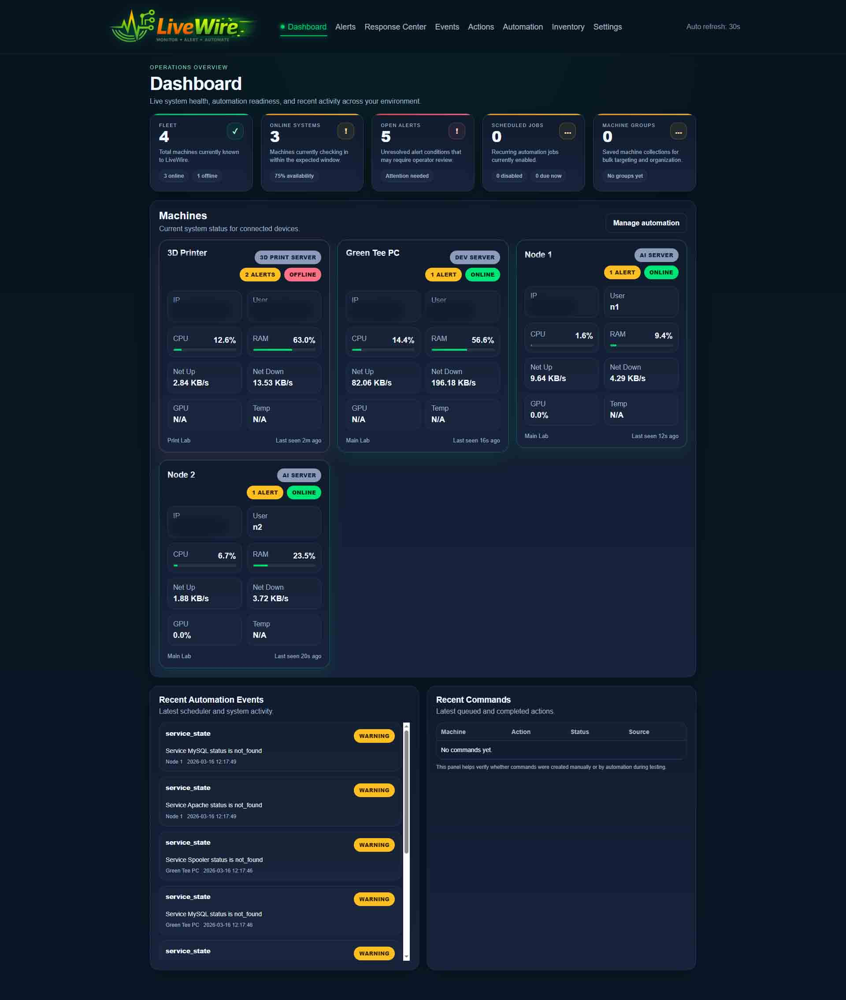
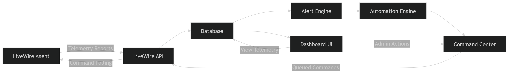

# ⚡ LiveWire

<p align="center">
  
</p>

<p align="center">
<b>Lightweight Infrastructure Monitoring & Automated Response Platform</b>
</p>

<p align="center">
Real-time telemetry • alert detection • automation • remote command execution
</p>

<p align="center">


</p>

<p align="center">


</p>

---

# Overview

**LiveWire** is a lightweight infrastructure monitoring and response platform designed for internal networks, homelabs, and small operational environments.

It provides a centralized dashboard that monitors machines running a lightweight agent and enables administrators to:

* Monitor system health
* Detect operational issues
* Trigger automated remediation
* Execute remote commands
* Track events and alerts in real time
* Manage infrastructure through automation workflows

LiveWire is designed to be:

• Simple to deploy
• Lightweight and fast
• Automation-focused
• Easy to extend

---

# 🚧 Project Status

**LiveWire is currently in Phase 9 — Stabilization & Expansion.**

Recent development includes:

* Response Center with approval workflows
* Expanded automation engine
* Inventory tracking system
* Machine grouping support
* UI/UX standardization across dashboard
* Database schema normalization

⚠️ This repository represents a **working development build**.

---

# Dashboard Preview

<p align="center">
  
</p>

The dashboard provides real-time operational visibility including:

* Machine health
* System telemetry
* Alerts
* Command activity
* Automation status
* Event history

---

# Architecture

<p align="center">
  
</p>

LiveWire follows a modular service architecture:

```
Agent
  ↓
API
  ↓
Database
  ↓
Alert Engine
  ↓
Automation Engine
  ↓
Command Center
  ↓
Response Center
  ↓
Dashboard
```

---

# Key Features

## Infrastructure Monitoring

LiveWire agents collect extended telemetry including:

* CPU usage + temperature
* Memory usage
* Disk utilization (per drive)
* Network throughput (per interface)
* Disk I/O
* GPU metrics (usage, temperature, VRAM)
* Running processes (top usage)
* Service states
* System uptime
* Machine connectivity status

---

## Alert Detection

Incoming telemetry is evaluated against configurable thresholds.

When thresholds are exceeded LiveWire can:

* Generate alerts
* Log events
* Trigger automation rules
* Queue remediation commands

---

## Automation Engine

Automation rules allow the system to automatically respond to issues.

Example:

```
IF CPU > 95% for 5 minutes
THEN restart_service
```

Features:

* Threshold-based triggers
* Severity levels
* Cooldowns
* Auto-approval options
* Alert-driven execution

---

## Response Center (NEW)

Centralized control for system actions:

* Pending approvals
* Approved actions
* Rejected commands
* Execution tracking

Supports both:

* Manual approval workflows
* Fully automated remediation

---

## Remote Command Center

Administrators can issue commands directly to monitored machines.

Examples:

```
restart_service
stop_process
reboot_machine
```

Features:

* Command queueing
* Execution tracking
* Source attribution (dashboard, automation, alerts)

---

## Machine Groups

Organize infrastructure logically:

* Group machines by role (web, database, etc.)
* Execute commands at group level
* Apply automation rules to groups

---

## Inventory System

Tracks deeper system information:

* Installed software
* System metadata
* Hardware snapshots

Future goal:
→ Full asset management system

---

## Scheduler System

LiveWire includes a lightweight scheduler responsible for:

* Evaluating automation rules
* Processing queued commands
* Running remediation checks

⚠️ Current behavior:

* Runs during page loads

Future:
→ Dedicated background worker

---

## UI / UX

Recent improvements include:

* Unified `#00cc66` theme
* Real-time summary cards
* Metric bars and indicators
* Modal-based command details
* Improved navigation and layout

---

# Project Structure

```
livewire/
│
├── app.py
├── config.py
├── database.py
├── requirements.txt
├── README.md
│
├── agents/
│   └── agent.py
│
├── routes/
│   ├── dashboard.py
│   ├── machines.py
│   ├── alerts.py
│   ├── actions.py
│   ├── automation.py
│   ├── inventory.py
│   └── api.py
│
├── services/
│   ├── alert_engine.py
│   ├── command_center.py
│   ├── remediation_engine.py
│   ├── group_service.py
│   ├── runtime_settings.py
│   └── helpers.py
│
├── templates/
├── static/
└── instance/
```

---

# Installation

### Clone the Repository

```
git clone https://github.com/YOURUSERNAME/livewire.git
cd livewire
```

---

### Create Virtual Environment

Windows

```
python -m venv venv
venv\Scripts\activate
```

Linux / Mac

```
python3 -m venv venv
source venv/bin/activate
```

---

### Install Dependencies

```
pip install -r requirements.txt
```

---

### Start the LiveWire Server

```
python app.py
```

The dashboard will start at:

```
http://localhost:5000
```

---

# Running the LiveWire Agent

Open:

```
agents/agent.py
```

Set:

```python
SERVER_URL = "http://your-server-ip:5000"
API_KEY = "your-api-key"
```

Run:

```
python agents/agent.py
```

The machine will automatically appear in the dashboard.

---

# Security

* API key authentication
* Command validation
* Approval workflows for sensitive actions

---

# Database

LiveWire uses SQLite by default:

```
instance/dashboard.db
```

Includes:

* machines
* snapshots
* alerts
* remote_commands
* remediation_rules
* notification_logs
* inventory tables

---

# Development

Run LiveWire in development mode:

```
python app.py
```

Flask automatically reloads when code changes.

---

# Future Development

Planned improvements:

* WebSocket real-time updates
* Notification integrations (Discord, Email, etc.)
* Advanced alert rules
* Role-based authentication
* Automation workflow builder
* Historical metrics visualization
* Agent auto-update capability
* Plugin architecture

---

# Author

**Trevor Elliott**
Green Tee Design

---

# License

This project is provided as a learning and experimentation platform for infrastructure automation and monitoring systems.
